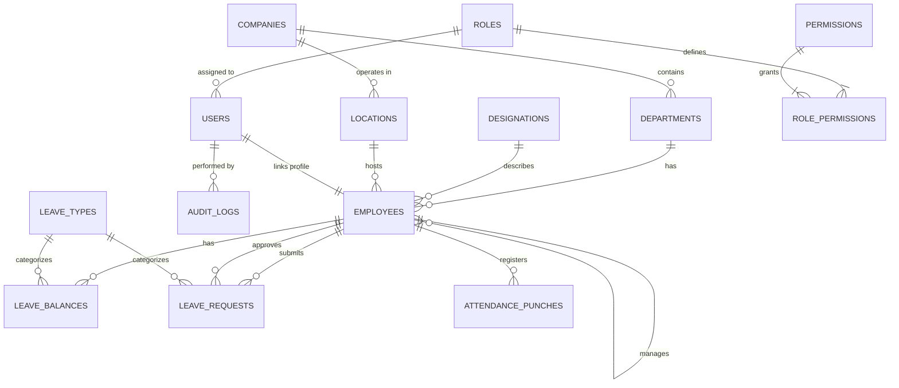

<!-- Run schema: psql -U hrms_admin -d hrms_db -f schema.sql -->

# HRMS Database Design Specification

PostgreSQL database design and schema specification for the Enterprise HRMS application.

---

## Overview & Key Architecture Notes

- **Primary Keys**: All tables use UUIDs generated via `gen_random_uuid()` for safer public IDs and distributed sync.
- **Auth vs Profile Separation**: `users` handles authentication credentials (email/password), while `employees` stores personal profile & HR data.
- **RBAC**: Role and permission-based access control via `roles`, `permissions`, and junction table `role_permissions`.
- **Org Hierarchy**: Self-referencing FK on `employees.reporting_manager_id`.
- **Audit Trail**: Track critical changes in `audit_logs` using PostgreSQL `JSONB`.

---

## Table of Contents

1. [Entity-Relationship Diagram](#entity-relationship-diagram)
2. [Core Organization](#core-organization)
3. [Identity & RBAC](#identity--rbac)
4. [Employees & Audit](#employees--audit)
5. [Leave Management](#leave-management)
6. [Attendance Tracking](#attendance-tracking)
7. [Running Schema](#running-schema)

---

## Entity-Relationship Diagram



---

## Core Organization

### 1. `companies`
Stores top-level company/tenant details.

| Column | Type | Constraints | Description |
| :--- | :--- | :--- | :--- |
| `id` | `UUID` | `PRIMARY KEY`, `DEFAULT gen_random_uuid()` | Primary Key |
| `name` | `VARCHAR(150)` | `NOT NULL` | Company Name |
| `registration_number` | `VARCHAR(50)` | — | Reg/Tax Number |
| `country` | `VARCHAR(50)` | `DEFAULT 'India'` | Country of Operation |
| `currency` | `VARCHAR(10)` | `DEFAULT 'INR'` | Base Currency |
| `is_active` | `BOOLEAN` | `DEFAULT TRUE` | Active Flag |
| `created_at` | `TIMESTAMP` | `DEFAULT NOW()` | Created Timestamp |

```sql
CREATE TABLE companies (
    id UUID PRIMARY KEY DEFAULT gen_random_uuid(),
    name VARCHAR(150) NOT NULL,
    registration_number VARCHAR(50),
    country VARCHAR(50) DEFAULT 'India',
    currency VARCHAR(10) DEFAULT 'INR',
    is_active BOOLEAN DEFAULT TRUE,
    created_at TIMESTAMP DEFAULT NOW()
);
```

### 2. `departments`
Functional departments within a company.

| Column | Type | Constraints | Description |
| :--- | :--- | :--- | :--- |
| `id` | `UUID` | `PRIMARY KEY`, `DEFAULT gen_random_uuid()` | Primary Key |
| `company_id` | `UUID` | `NOT NULL`, `REFERENCES companies(id)` | Company FK |
| `name` | `VARCHAR(100)` | `NOT NULL` | Department Name |
| `is_active` | `BOOLEAN` | `DEFAULT TRUE` | Active Flag |
| `created_at` | `TIMESTAMP` | `DEFAULT NOW()` | Created Timestamp |

```sql
CREATE TABLE departments (
    id UUID PRIMARY KEY DEFAULT gen_random_uuid(),
    company_id UUID NOT NULL REFERENCES companies(id),
    name VARCHAR(100) NOT NULL,
    is_active BOOLEAN DEFAULT TRUE,
    created_at TIMESTAMP DEFAULT NOW()
);
```

### 3. `locations`
Physical office locations and branches.

| Column | Type | Constraints | Description |
| :--- | :--- | :--- | :--- |
| `id` | `UUID` | `PRIMARY KEY`, `DEFAULT gen_random_uuid()` | Primary Key |
| `company_id` | `UUID` | `NOT NULL`, `REFERENCES companies(id)` | Company FK |
| `name` | `VARCHAR(100)` | `NOT NULL` | Location Name (e.g. 'Pune Office') |
| `address` | `TEXT` | — | Address |
| `is_active` | `BOOLEAN` | `DEFAULT TRUE` | Active Flag |

```sql
CREATE TABLE locations (
    id UUID PRIMARY KEY DEFAULT gen_random_uuid(),
    company_id UUID NOT NULL REFERENCES companies(id),
    name VARCHAR(100) NOT NULL,
    address TEXT,
    is_active BOOLEAN DEFAULT TRUE
);
```

### 4. `designations`
Job titles and grades across the organization.

| Column | Type | Constraints | Description |
| :--- | :--- | :--- | :--- |
| `id` | `UUID` | `PRIMARY KEY`, `DEFAULT gen_random_uuid()` | Primary Key |
| `title` | `VARCHAR(100)` | `NOT NULL` | Job Title (e.g. 'Software Engineer') |
| `grade` | `VARCHAR(20)` | — | Grade/Level (e.g. 'L2', 'Senior') |
| `is_active` | `BOOLEAN` | `DEFAULT TRUE` | Active Flag |

```sql
CREATE TABLE designations (
    id UUID PRIMARY KEY DEFAULT gen_random_uuid(),
    title VARCHAR(100) NOT NULL,
    grade VARCHAR(20),
    is_active BOOLEAN DEFAULT TRUE
);
```

---

## Identity & RBAC

### 5. `roles`
System access roles (`Employee`, `Manager`, `HR`, `Admin`).

| Column | Type | Constraints | Description |
| :--- | :--- | :--- | :--- |
| `id` | `UUID` | `PRIMARY KEY`, `DEFAULT gen_random_uuid()` | Primary Key |
| `name` | `VARCHAR(50)` | `UNIQUE`, `NOT NULL` | Role Name |
| `description` | `TEXT` | — | Role Description |

```sql
CREATE TABLE roles (
    id UUID PRIMARY KEY DEFAULT gen_random_uuid(),
    name VARCHAR(50) UNIQUE NOT NULL,
    description TEXT
);
```

### 6. `permissions`
Granular permission codes (`leave.approve`, `employee.create`).

| Column | Type | Constraints | Description |
| :--- | :--- | :--- | :--- |
| `id` | `UUID` | `PRIMARY KEY`, `DEFAULT gen_random_uuid()` | Primary Key |
| `code` | `VARCHAR(80)` | `UNIQUE`, `NOT NULL` | Permission Code |
| `description` | `TEXT` | — | Description |

```sql
CREATE TABLE permissions (
    id UUID PRIMARY KEY DEFAULT gen_random_uuid(),
    code VARCHAR(80) UNIQUE NOT NULL,
    description TEXT
);
```

### 7. `role_permissions`
Many-to-many junction table linking roles and permissions.

| Column | Type | Constraints | Description |
| :--- | :--- | :--- | :--- |
| `role_id` | `UUID` | `NOT NULL`, `REFERENCES roles(id)` | Role FK |
| `permission_id` | `UUID` | `NOT NULL`, `REFERENCES permissions(id)` | Permission FK |

> Primary Key: `(role_id, permission_id)`

```sql
CREATE TABLE role_permissions (
    role_id UUID NOT NULL REFERENCES roles(id),
    permission_id UUID NOT NULL REFERENCES permissions(id),
    PRIMARY KEY (role_id, permission_id)
);
```

### 8. `users`
Authentication accounts (separated from employee profile details).

| Column | Type | Constraints | Description |
| :--- | :--- | :--- | :--- |
| `id` | `UUID` | `PRIMARY KEY`, `DEFAULT gen_random_uuid()` | Primary Key |
| `email` | `VARCHAR(150)` | `UNIQUE`, `NOT NULL` | Login Email |
| `password_hash` | `VARCHAR(255)` | `NOT NULL` | Bcrypt Hash |
| `role_id` | `UUID` | `NOT NULL`, `REFERENCES roles(id)` | Role FK |
| `is_active` | `BOOLEAN` | `DEFAULT TRUE` | Active Flag |
| `last_login` | `TIMESTAMP` | — | Last Login Timestamp |
| `created_at` | `TIMESTAMP` | `DEFAULT NOW()` | Created Timestamp |

```sql
CREATE TABLE users (
    id UUID PRIMARY KEY DEFAULT gen_random_uuid(),
    email VARCHAR(150) UNIQUE NOT NULL,
    password_hash VARCHAR(255) NOT NULL,
    role_id UUID NOT NULL REFERENCES roles(id),
    is_active BOOLEAN DEFAULT TRUE,
    last_login TIMESTAMP,
    created_at TIMESTAMP DEFAULT NOW()
);
```

---

## Employees & Audit

### 9. `employees`
Core employee profile information and organizational links.

| Column | Type | Constraints | Description |
| :--- | :--- | :--- | :--- |
| `id` | `UUID` | `PRIMARY KEY`, `DEFAULT gen_random_uuid()` | Primary Key |
| `user_id` | `UUID` | `UNIQUE`, `REFERENCES users(id)` | Auth User FK |
| `employee_code` | `VARCHAR(20)` | `UNIQUE`, `NOT NULL` | Code (e.g. 'EMP-2026-0001') |
| `first_name` | `VARCHAR(80)` | `NOT NULL` | First Name |
| `last_name` | `VARCHAR(80)` | `NOT NULL` | Last Name |
| `date_of_birth` | `DATE` | — | DOB |
| `gender` | `VARCHAR(20)` | — | Gender |
| `personal_email` | `VARCHAR(150)` | — | Personal Email |
| `personal_mobile` | `VARCHAR(20)` | — | Mobile Number |
| `address` | `TEXT` | — | Address |
| `department_id` | `UUID` | `REFERENCES departments(id)` | Department FK |
| `designation_id` | `UUID` | `REFERENCES designations(id)` | Designation FK |
| `location_id` | `UUID` | `REFERENCES locations(id)` | Location FK |
| `reporting_manager_id` | `UUID` | `REFERENCES employees(id)` | Reporting Manager FK (Self-reference) |
| `date_of_joining` | `DATE` | `NOT NULL` | Date of Joining |
| `employment_type` | `VARCHAR(30)` | `DEFAULT 'Full-time'` | Employment Type |
| `status` | `VARCHAR(20)` | `DEFAULT 'Active'` | Status ('Active', etc.) |
| `created_at` | `TIMESTAMP` | `DEFAULT NOW()` | Created Timestamp |

```sql
CREATE TABLE employees (
    id UUID PRIMARY KEY DEFAULT gen_random_uuid(),
    user_id UUID UNIQUE REFERENCES users(id),
    employee_code VARCHAR(20) UNIQUE NOT NULL,
    first_name VARCHAR(80) NOT NULL,
    last_name VARCHAR(80) NOT NULL,
    date_of_birth DATE,
    gender VARCHAR(20),
    personal_email VARCHAR(150),
    personal_mobile VARCHAR(20),
    address TEXT,
    department_id UUID REFERENCES departments(id),
    designation_id UUID REFERENCES designations(id),
    location_id UUID REFERENCES locations(id),
    reporting_manager_id UUID REFERENCES employees(id), 
    date_of_joining DATE NOT NULL,
    employment_type VARCHAR(30) DEFAULT 'Full-time', 
    status VARCHAR(20) DEFAULT 'Active',
    created_at TIMESTAMP DEFAULT NOW()
);
```

### 10. `audit_logs`
Tracks state changes across entities for security & audit.

| Column | Type | Constraints | Description |
| :--- | :--- | :--- | :--- |
| `id` | `UUID` | `PRIMARY KEY`, `DEFAULT gen_random_uuid()` | Primary Key |
| `actor_user_id` | `UUID` | `REFERENCES users(id)` | Actor User FK |
| `action` | `VARCHAR(50)` | `NOT NULL` | Action ('CREATE', 'UPDATE', 'DELETE') |
| `entity_type` | `VARCHAR(50)` | `NOT NULL` | Target Table |
| `entity_id` | `UUID` | — | Target Row PK |
| `old_value` | `JSONB` | — | Pre-mutation JSON |
| `new_value` | `JSONB` | — | Post-mutation JSON |
| `created_at` | `TIMESTAMP` | `DEFAULT NOW()` | Created Timestamp |

```sql
CREATE TABLE audit_logs (
    id UUID PRIMARY KEY DEFAULT gen_random_uuid(),
    actor_user_id UUID REFERENCES users(id),
    action VARCHAR(50) NOT NULL, 
    entity_type VARCHAR(50) NOT NULL,
    entity_id UUID,
    old_value JSONB,
    new_value JSONB,
    created_at TIMESTAMP DEFAULT NOW()
);
```

---

## Leave Management

### 11. `leave_types`
Leave categories ('Casual', 'Sick', 'Earned').

| Column | Type | Constraints | Description |
| :--- | :--- | :--- | :--- |
| `id` | `UUID` | `PRIMARY KEY`, `DEFAULT gen_random_uuid()` | Primary Key |
| `name` | `VARCHAR(50)` | `NOT NULL` | Leave Type Name |
| `default_annual_days` | `INT` | `DEFAULT 0` | Default Annual Allowance |

```sql
CREATE TABLE leave_types (
    id UUID PRIMARY KEY DEFAULT gen_random_uuid(),
    name VARCHAR(50) NOT NULL,
    default_annual_days INT DEFAULT 0
);
```

### 12. `leave_balances`
Annual leave balances per employee per leave category.

| Column | Type | Constraints | Description |
| :--- | :--- | :--- | :--- |
| `id` | `UUID` | `PRIMARY KEY`, `DEFAULT gen_random_uuid()` | Primary Key |
| `employee_id` | `UUID` | `NOT NULL`, `REFERENCES employees(id)` | Employee FK |
| `leave_type_id` | `UUID` | `NOT NULL`, `REFERENCES leave_types(id)` | Leave Type FK |
| `year` | `INT` | `NOT NULL` | Applicable Year |
| `total_days` | `NUMERIC(5,1)` | `DEFAULT 0` | Total Days Allocated |
| `used_days` | `NUMERIC(5,1)` | `DEFAULT 0` | Days Used |

> Unique Constraint: `(employee_id, leave_type_id, year)`

```sql
CREATE TABLE leave_balances (
    id UUID PRIMARY KEY DEFAULT gen_random_uuid(),
    employee_id UUID NOT NULL REFERENCES employees(id),
    leave_type_id UUID NOT NULL REFERENCES leave_types(id),
    year INT NOT NULL,
    total_days NUMERIC(5,1) DEFAULT 0,
    used_days NUMERIC(5,1) DEFAULT 0,
    UNIQUE (employee_id, leave_type_id, year)
);
```

### 13. `leave_requests`
Employee leave applications and approval status.

| Column | Type | Constraints | Description |
| :--- | :--- | :--- | :--- |
| `id` | `UUID` | `PRIMARY KEY`, `DEFAULT gen_random_uuid()` | Primary Key |
| `employee_id` | `UUID` | `NOT NULL`, `REFERENCES employees(id)` | Employee FK |
| `leave_type_id` | `UUID` | `NOT NULL`, `REFERENCES leave_types(id)` | Leave Type FK |
| `start_date` | `DATE` | `NOT NULL` | Start Date |
| `end_date` | `DATE` | `NOT NULL` | End Date |
| `reason` | `TEXT` | — | Reason |
| `status` | `VARCHAR(20)` | `DEFAULT 'Pending'` | Status ('Pending', 'Approved', 'Rejected') |
| `approved_by` | `UUID` | `REFERENCES employees(id)` | Approver Employee FK |
| `created_at` | `TIMESTAMP` | `DEFAULT NOW()` | Application Timestamp |

```sql
CREATE TABLE leave_requests (
    id UUID PRIMARY KEY DEFAULT gen_random_uuid(),
    employee_id UUID NOT NULL REFERENCES employees(id),
    leave_type_id UUID NOT NULL REFERENCES leave_types(id),
    start_date DATE NOT NULL,
    end_date DATE NOT NULL,
    reason TEXT,
    status VARCHAR(20) DEFAULT 'Pending',
    approved_by UUID REFERENCES employees(id),
    created_at TIMESTAMP DEFAULT NOW()
);
```

---

## Attendance Tracking

### 14. `attendance_shifts`
Shift timings definitions.

| Column | Type | Constraints | Description |
| :--- | :--- | :--- | :--- |
| `id` | `UUID` | `PRIMARY KEY`, `DEFAULT gen_random_uuid()` | Primary Key |
| `name` | `VARCHAR(50)` | `NOT NULL` | Shift Name (e.g. 'General Shift') |
| `start_time` | `TIME` | `NOT NULL` | Shift Start Time |
| `end_time` | `TIME` | `NOT NULL` | Shift End Time |

```sql
CREATE TABLE attendance_shifts (
    id UUID PRIMARY KEY DEFAULT gen_random_uuid(),
    name VARCHAR(50) NOT NULL,
    start_time TIME NOT NULL,
    end_time TIME NOT NULL
);
```

### 15. `attendance_punches`
Daily clock-in/out records.

| Column | Type | Constraints | Description |
| :--- | :--- | :--- | :--- |
| `id` | `UUID` | `PRIMARY KEY`, `DEFAULT gen_random_uuid()` | Primary Key |
| `employee_id` | `UUID` | `NOT NULL`, `REFERENCES employees(id)` | Employee FK |
| `punch_date` | `DATE` | `NOT NULL` | Date |
| `punch_in` | `TIMESTAMP` | — | Clock-In Time |
| `punch_out` | `TIMESTAMP` | — | Clock-Out Time |
| `method` | `VARCHAR(20)` | `DEFAULT 'Web'` | Method ('Web', 'Biometric', 'GPS') |

> Unique Constraint: `(employee_id, punch_date)`

```sql
CREATE TABLE attendance_punches (
    id UUID PRIMARY KEY DEFAULT gen_random_uuid(),
    employee_id UUID NOT NULL REFERENCES employees(id),
    punch_date DATE NOT NULL,
    punch_in TIMESTAMP,
    punch_out TIMESTAMP,
    method VARCHAR(20) DEFAULT 'Web',
    UNIQUE (employee_id, punch_date)
);
```

---

## Running Schema

Execute the schema against PostgreSQL:

```bash
psql -U hrms_admin -d hrms_db -f schema.sql
```