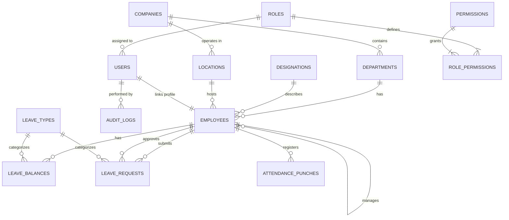

# Database Documentation

## Current Status

**No actual database exists.** The database schema exists only as a design document in `docs/03_Database_Design.md`. There is no migration setup, no Prisma schema, and no database connection. The project uses mock data in `src/mock/` instead.

The intended database is **PostgreSQL** with 15 tables.

## Entity-Relationship Diagram

## Tables

### 1. `companies`
Top-level company/tenant information.

| Column | Type | Constraints | Description |
|--------|------|-------------|-------------|
| `id` | UUID | PK, DEFAULT gen_random_uuid() | Primary key |
| `name` | VARCHAR(150) | NOT NULL | Company name |
| `registration_number` | VARCHAR(50) | — | Registration/tax number |
| `country` | VARCHAR(50) | DEFAULT 'India' | Country of operation |
| `currency` | VARCHAR(10) | DEFAULT 'INR' | Base currency |
| `is_active` | BOOLEAN | DEFAULT TRUE | Active flag |
| `created_at` | TIMESTAMP | DEFAULT NOW() | Created timestamp |

### 2. `departments`
Functional departments within a company.

| Column | Type | Constraints | Description |
|--------|------|-------------|-------------|
| `id` | UUID | PK, DEFAULT gen_random_uuid() | Primary key |
| `company_id` | UUID | NOT NULL, FK → companies(id) | Company |
| `name` | VARCHAR(100) | NOT NULL | Department name |
| `is_active` | BOOLEAN | DEFAULT TRUE | Active flag |
| `created_at` | TIMESTAMP | DEFAULT NOW() | Created timestamp |

### 3. `locations`
Physical office locations and branches.

| Column | Type | Constraints | Description |
|--------|------|-------------|-------------|
| `id` | UUID | PK, DEFAULT gen_random_uuid() | Primary key |
| `company_id` | UUID | NOT NULL, FK → companies(id) | Company |
| `name` | VARCHAR(100) | NOT NULL | Location name |
| `address` | TEXT | — | Address |
| `is_active` | BOOLEAN | DEFAULT TRUE | Active flag |

### 4. `designations`
Job titles and grades.

| Column | Type | Constraints | Description |
|--------|------|-------------|-------------|
| `id` | UUID | PK, DEFAULT gen_random_uuid() | Primary key |
| `title` | VARCHAR(100) | NOT NULL | Job title |
| `grade` | VARCHAR(20) | — | Grade/level |
| `is_active` | BOOLEAN | DEFAULT TRUE | Active flag |

### 5. `roles`
System access roles.

| Column | Type | Constraints | Description |
|--------|------|-------------|-------------|
| `id` | UUID | PK, DEFAULT gen_random_uuid() | Primary key |
| `name` | VARCHAR(50) | UNIQUE, NOT NULL | Role name (Admin, HR, Manager, Employee) |
| `description` | TEXT | — | Description |

### 6. `permissions`
Granular permission codes.

| Column | Type | Constraints | Description |
|--------|------|-------------|-------------|
| `id` | UUID | PK, DEFAULT gen_random_uuid() | Primary key |
| `code` | VARCHAR(80) | UNIQUE, NOT NULL | Permission code (e.g., `leave.approve`) |
| `description` | TEXT | — | Description |

### 7. `role_permissions`
Many-to-many junction table.

| Column | Type | Constraints | Description |
|--------|------|-------------|-------------|
| `role_id` | UUID | NOT NULL, FK → roles(id) | Role |
| `permission_id` | UUID | NOT NULL, FK → permissions(id) | Permission |

**Primary Key**: `(role_id, permission_id)`

### 8. `users`
Authentication accounts (separated from employee profiles).

| Column | Type | Constraints | Description |
|--------|------|-------------|-------------|
| `id` | UUID | PK, DEFAULT gen_random_uuid() | Primary key |
| `email` | VARCHAR(150) | UNIQUE, NOT NULL | Login email |
| `password_hash` | VARCHAR(255) | NOT NULL | bcrypt hash |
| `role_id` | UUID | NOT NULL, FK → roles(id) | Role |
| `is_active` | BOOLEAN | DEFAULT TRUE | Active flag |
| `last_login` | TIMESTAMP | — | Last login timestamp |
| `created_at` | TIMESTAMP | DEFAULT NOW() | Created timestamp |

### 9. `employees`
Core employee profile information.

| Column | Type | Constraints | Description |
|--------|------|-------------|-------------|
| `id` | UUID | PK, DEFAULT gen_random_uuid() | Primary key |
| `user_id` | UUID | UNIQUE, FK → users(id) | Auth user |
| `employee_code` | VARCHAR(20) | UNIQUE, NOT NULL | Employee code |
| `first_name` | VARCHAR(80) | NOT NULL | First name |
| `last_name` | VARCHAR(80) | NOT NULL | Last name |
| `date_of_birth` | DATE | — | Date of birth |
| `gender` | VARCHAR(20) | — | Gender |
| `personal_email` | VARCHAR(150) | — | Personal email |
| `personal_mobile` | VARCHAR(20) | — | Mobile number |
| `address` | TEXT | — | Address |
| `department_id` | UUID | FK → departments(id) | Department |
| `designation_id` | UUID | FK → designations(id) | Designation |
| `location_id` | UUID | FK → locations(id) | Location |
| `reporting_manager_id` | UUID | FK → employees(id) | Manager (self-ref) |
| `date_of_joining` | DATE | NOT NULL | Date of joining |
| `employment_type` | VARCHAR(30) | DEFAULT 'Full-time' | Employment type |
| `status` | VARCHAR(20) | DEFAULT 'Active' | Employee status |
| `created_at` | TIMESTAMP | DEFAULT NOW() | Created timestamp |

### 10. `audit_logs`
Tracks state changes for security and audit.

| Column | Type | Constraints | Description |
|--------|------|-------------|-------------|
| `id` | UUID | PK, DEFAULT gen_random_uuid() | Primary key |
| `actor_user_id` | UUID | FK → users(id) | Actor |
| `action` | VARCHAR(50) | NOT NULL | Action (CREATE, UPDATE, DELETE) |
| `entity_type` | VARCHAR(50) | NOT NULL | Target table name |
| `entity_id` | UUID | — | Target row PK |
| `old_value` | JSONB | — | Pre-mutation state |
| `new_value` | JSONB | — | Post-mutation state |
| `created_at` | TIMESTAMP | DEFAULT NOW() | Created timestamp |

### 11. `leave_types`
Leave categories.

| Column | Type | Constraints | Description |
|--------|------|-------------|-------------|
| `id` | UUID | PK, DEFAULT gen_random_uuid() | Primary key |
| `name` | VARCHAR(50) | NOT NULL | Leave type name |
| `default_annual_days` | INT | DEFAULT 0 | Default annual allowance |

### 12. `leave_balances`
Annual leave balances per employee per type.

| Column | Type | Constraints | Description |
|--------|------|-------------|-------------|
| `id` | UUID | PK, DEFAULT gen_random_uuid() | Primary key |
| `employee_id` | UUID | NOT NULL, FK → employees(id) | Employee |
| `leave_type_id` | UUID | NOT NULL, FK → leave_types(id) | Leave type |
| `year` | INT | NOT NULL | Applicable year |
| `total_days` | NUMERIC(5,1) | DEFAULT 0 | Total allocated |
| `used_days` | NUMERIC(5,1) | DEFAULT 0 | Days used |

**Unique Constraint**: `(employee_id, leave_type_id, year)`

### 13. `leave_requests`
Employee leave applications.

| Column | Type | Constraints | Description |
|--------|------|-------------|-------------|
| `id` | UUID | PK, DEFAULT gen_random_uuid() | Primary key |
| `employee_id` | UUID | NOT NULL, FK → employees(id) | Employee |
| `leave_type_id` | UUID | NOT NULL, FK → leave_types(id) | Leave type |
| `start_date` | DATE | NOT NULL | Start date |
| `end_date` | DATE | NOT NULL | End date |
| `reason` | TEXT | — | Reason |
| `status` | VARCHAR(20) | DEFAULT 'Pending' | Status |
| `approved_by` | UUID | FK → employees(id) | Approver |
| `created_at` | TIMESTAMP | DEFAULT NOW() | Created timestamp |

### 14. `attendance_shifts`
Shift timing definitions.

| Column | Type | Constraints | Description |
|--------|------|-------------|-------------|
| `id` | UUID | PK, DEFAULT gen_random_uuid() | Primary key |
| `name` | VARCHAR(50) | NOT NULL | Shift name |
| `start_time` | TIME | NOT NULL | Shift start |
| `end_time` | TIME | NOT NULL | Shift end |

### 15. `attendance_punches`
Daily clock-in/out records.

| Column | Type | Constraints | Description |
|--------|------|-------------|-------------|
| `id` | UUID | PK, DEFAULT gen_random_uuid() | Primary key |
| `employee_id` | UUID | NOT NULL, FK → employees(id) | Employee |
| `punch_date` | DATE | NOT NULL | Date |
| `punch_in` | TIMESTAMP | — | Clock-in time |
| `punch_out` | TIMESTAMP | — | Clock-out time |
| `method` | VARCHAR(20) | DEFAULT 'Web' | Method (Web, Biometric, GPS) |

**Unique Constraint**: `(employee_id, punch_date)`

## Key Relationships

1. **Company → Departments/Locations**: One company has many departments and locations
2. **User → Employee**: One-to-one; auth credentials are separate from HR profile
3. **Employee → Employee (self)**: Reporting manager is a self-referencing FK
4. **Role → Permission**: Many-to-many via `role_permissions` junction
5. **Employee → Leave Balances**: One employee has one balance per leave type per year
6. **Employee → Leave Requests**: Employee can submit and approve leave requests
7. **Employee → Attendance Punches**: One attendance record per employee per day

## Constraints

- All primary keys use UUIDs with `gen_random_uuid()`
- Unique constraints on: `roles(name)`, `permissions(code)`, `users(email)`, `employees(employee_code)`, `employees(user_id)`, `leave_balances(employee_id, leave_type_id, year)`, `attendance_punches(employee_id, punch_date)`
- Foreign keys use `REFERENCES` with no explicit `ON DELETE CASCADE` (must be added)
- No indexes are defined in the design document (should be added for performance)
